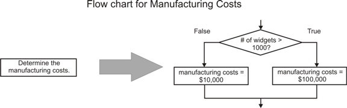

<!--
author:   Darryl Morrell, Ph.D.; Anders Gjendemsjø, Ph.D.

email:    LiaScript@web.de

version:  0.0.1

language: en

narrator: US English Female

comment:  MATLAB is a programming language used by several computational packages known as m-file environments. This text introduces freshman engineering students to problem solving using an m-file environment.

logo:     ../cover.jpg

tags:      matlab, engineering

-->

# An Introduction to Solving Engineering Problems with MATLAB

> This document was automatically translated to LiaScript from
>
> https://www.ck12.org/book/engineering%3a-an-introduction-to-solving-engineering-problems-with-matlab/

## 1.0 Introduction to Problem Solving With MATLAB

<article>

MATLAB(TM) has emerged as a widely used computational tool in many fields of engineering. MATLAB consists of a programming language used in an interactive computing environment that supports programming to solve complex problems. The MATLAB language has become a defacto standard that is also used by several other computational packages; these including LabVIEW MathScript(TM) and Octave. Generically, we refer to these packages as m-file environments because the program files are typically identified by an extension of "m".

</article>

### 1.1 M-file Environments

<article>

This text is intended to introduce freshman engineering students to problem solving using an m-file environment. Most of the information in this text applies to any m-file environment (MATLAB, LabVIEW MathScript, Octave, etc.). There are some differences between environments, and occasionally some material will be specific to a given environment. This material is offset from the surrounding text and labeled with the appropriate environment. For example:

__**MATLAB**: Matlab is a commercial product of The MathWorks (http://www.mathworks.com/)__

**Octave**: Octave is an open source environment that is available without charge. Information about Octave is available at the Octave home page (http://www.octave.org/)

</article>

### 1.2 Finding Help for M-file Environments

<article>

There is a wealth of information available about using most m-file environments. In fact, the amount of information may overwhelm someone who is beginning.

The help command can be used to get information about a specific command or function. For example, typing _help cos_ at the command prompt will give information about the cosine function. Typing _help_ will give general information.

A significant amount of information is available on the World Wide Web:

__**MATLAB**: Useful information is available at the MATLAB Helpdesk page (http://www.mathworks.de/help/pdf_doc/matlab/programming_tips.pdf)__

**MATLAB**: Useful information is available at the MATLAB Helpdesk page (http://www.mathworks.de/help/pdf_doc/matlab/programming_tips.pdf)

__**LabVIEW MathScript**: Useful information is available at the National Instruments LabVIEW MathScript Portal (http://www.ni.com/labview/mathscript/)__

**LabVIEW MathScript**: Useful information is available at the National Instruments LabVIEW MathScript Portal (http://www.ni.com/labview/mathscript/)

Includes an interactive demonstration of MathScript (http://www.ni.com/swf/demos/us/labview/mscriptwindow/default.htm)

__**Octave**: The definitive source for information is The official GNU Octave Manual (http://www.gnu.org/software/octave/doc/interpreter/index.html#Top)__

**Octave**: The definitive source for information is The official GNU Octave Manual (http://www.gnu.org/software/octave/doc/interpreter/index.html#Top)

Also, one of many good tutorials is available (http://en.wikibooks.org/wiki/MATLAB_Programming/GNU_Octave)

</article>

## 2.0 Problem Solving

<article>

AUTHOR: Darryl Morrell

 SOURCE: Problem Solving with MATLAB
 ATTRIBUTION: This text adapted from the content with CC-BY license available at 
  http://cnx.org/content/m13694/1.4/
  http://cnx.org/content/m13865/1.1/
  http://cnx.org/content/m13820/1.3/

</article>

### 2.1 Problem Solving Using M-file Environments

<article>

The purpose of this section is to introduce the engineering problem solving process in the context of using m-file environments to solve problems. Many variations of this process exist and no single variation is best for solving all problems. In this module we describe a variation of the engineering problem solving process that applies to m-file environments problem solving. Other variations are described in the reference in the bibliography.

The following problem solving process is fairly involved and may be an excessive amount of work for simple problems. For problems where the solution is straight forward, simply solve the problem; for more complex problems, the solution will usually not be obvious and this process will aid in development of an appropriate solution.

This specific process is divided into a set of seven steps. Each step includes questions that help move you successfully through the problem solving process.

1. Define the Problem

* What problem are you trying to solve?
* "What would success look like?"
* What should the program output? Computed values? A plot or series of plots?

2. Identify given information.

* What constants or data are supplied?
* What theory, principles, models and equations have you been given?

3. Identify other available information.

* What theory, principles, models and equations can you find in other sources (text books, lecture notes, etc.)?

4. Identify further needed information.

* What other information do you need?
* Where will you find it?

5. Design and implement your solution to the problem.

* How can you break the larger problem into smaller problems?
* Look at the problem from the top down or bottom up?
* What programming techniques might you use to convert input to output?
* What variables do you need? Vectors? Arrays?
* What principles and equations apply to convert input to output?

6. Verify your solution.

* How do you know your solution is correct?

7. Reflect on your solution.

* What worked?
* What didn't?

When solving simple problems you may be able to follow these steps in order. For more complex problems, you may be working on step 5 and realize you need more information. You might then go back to steps 3 or 4 to re-evaluate and find missing information.

**Exercise**

_You are part of a design team that is developing a commercial aluminum can crusher. Your preliminary crusher design includes a collection chamber in which cans are collected until a desired weight of cans has accumulated; the cans are then crushed by a hydraulic ram. In preliminary research, you determine that the typical aluminum can is a cylinder with diameter $2.5''$ and height $4.8''$ and weighs approximately 15 grams. You have been assigned to model the relationship between the size of the chamber and the weight of (uncrushed) cans it would hold. Use the problem solving process to work through this process._

</article>

### 2.2 Visual Tools for Problem Solving

<article>

Using an abstract visual representation while developing a program structure is often a useful technique. Several different visual representations have been developed; one of the most comprehensive is UML. Two of the simplest are introduced in this section: flow charts and pseudo code. In both flow charts and pseudo code, elements of the problem solution are described using natural language statements that are visually arranged to show the structure of the program.

A flow chart represents elements of the solution to a problem as statements enclosed in boxes; the sequence in which use elements are performed is identified by arrows connecting the boxes. Figure [below](#x-ck12-TWF0aExhYmYxLTAx) shows an example flow chart.

Pseudo code represents the elements of the solution to a problem as a sequence of statements.The statements are formatted to show the logical structure of the solution. Figure [below](#x-ck12-TWF0aExhYmYyLTAy) shows an example of pseudo code.

The following example demonstrates the use of flow charts and pseudo code to develop the structure of a program that solves an engineering problem.

The ACME Manufacturing Company is planning to manufacture widgets. There are two different manufacturing processes: one costs $10,000 to implement and can manufacture up to 1000 widgets, while the other costs $100,000 to implement and can manufacture up to one million widgets. In addition to the manufacturing cost, there is a fixed cost of $1 per widget for packing and shipping each widget to the customer. Consider the problem of calculating the cost per unit to manufacture and ship a given number of widgets.

One way to solve the problem is to complete the following steps:

* Get the number of widgets to be produced.
* Determine the total manufacturing costs.
* Determine the total fixed costs.
* Determine the total cost.
* Compute the cost per unit.

Figure [below](#x-ck12-TWF0aExhYmYxLTAx) shows a flow chart that represents these steps. The example below shows the pseudo code that represents these steps.

> ### Pseudo code for the widget production problem.
> 
> __Get the number of widgets to be produced.__
> 
> Compute the cost per unit.

Having developed an initial solution, we can refine those elements whose implementation may not yet be fully defined. In this example, the manufacturing cost depend on the number of widgets to be made; if this number is less than or equal to $1000$, the cost is $$10,000$, while if the number is greater than 1000, the cost is $100,000. We can represent this using the flow chart blocks in the image (Figure [below](#x-ck12-TWF0aExhYmYyLTAy)). The diamond is a conditional; the branch of the flow chart that is actually executed depends on whether the conditional is true or false.

Putting this conditional into the complete flow chart gives the flow chart in the Figure [below](#x-ck12-TWF0aExhYi1maWcyLTA0). The conditional is incorporated in the pseudo code to give the pseudo code in the example below.

> ### Pseudo code for the widget production problem.
> 
> __Get the number of widgets to be produced.__
> 
> Compute the cost per unit.

There are advantages and disadvantages for both flow charts and pseudo code. Advantages of using a flow chart include that it provides a strong visual representation of the program and that it is straightforward for novice programmers to use. The primary disadvantage of using a flow chart is that it is possible to create a flow chart that can only be implemented by "spaghetti code", or code with a complex and interwoven structure. Spaghetti code is considered extremely bad form for many reasons; in particular, it is hard to understand, debug and modify. The primary advantage of pseudo code is that its structure is clearly related to the available control structures in modern computer languages. Pseudo code has several disadvantages: it is not a very strong visual representation, and it is less straightforward for novice programmers.

</article>

### 2.3 Bibliography

<article>

* H. Scott Fogler, Steven E. LeBlanc. _Strategies for Creative Problem Solving_, Prentice Hall, 1995.

</article>

## 3.0 Basic Mathematical Computations

<article>

AUTHOR: Darryl Morrell and Anders Gjendemsjø

 SOURCE: Problem Solving with MATLAB
 ATTRIBUTION: This text adapted from the content with CC-BY license available at
  http://cnx.org/content/m13439/1.7/
  http://cnx.org/content/m13354/1.3/
  http://cnx.org/content/m13832/1.4/
  http://cnx.org/content/m13355/1.2/
  http://cnx.org/content/m13751/1.2/

In the following, text that could be input to an m-file environment is denoted in this color and text that is output by an m-file environment is denoted in this color.

</article>

### 3.1 Basic Mathematical Operations

<article>

Operations and Expressions
--------------------------

An m-file environment has all of the standard arithmetic operations (addition, subtraction, etc.) and functions (sine, cosine, logarithm, etc.). Table [below](#x-ck12-eC1jazEyLVpYbG9NSEJxWW1aa2R3Li4.) lists the most commonly used operations; in this table, $x$ and $y$ are _scalars._ (A scalar is a single value, as opposed to a vector or matrix which consists of many values.)

|     |     |
| --- | --- |Some Common Scalar Mathematical Operations.
| Operation | m-file |
| --- | --- |
| $x - y$ | x - y |
| $x + y$ | x + y |
| $xy$ | x\*y |
| $\tfrac{x}{y}$ | x/y |
| $x^y$ | x^y |
| $e^x$ | exp(x) |
| $\log_{10}(x)$ | log10(x) |
| $\ln(x)$ | log(x) |
| $\log_2(x)$ | log2(x) |
| $\cos(x)$ | cos(x) |
| $\sin(x)$ | sin(x) |
| $\sqrt{x}$ | sqrt(x) |

_Expressions_ are formed from numbers, variables, and these operations. The operations have different precedences. The ^ operation has the highest precedence; ^ operations are evaluated before any other operations. Multiplication and division have the next highest precedence, and addition and subtraction have the lowest precedence. Precedence is altered by parentheses; expressions within parentheses are evaluated before expressions outside parentheses.

**Example 1**

_Table [below](#x-ck12-eC1jazEyLU5tRnhkbVpsTTNwemNnLi4.) shows several mathematical formulas, the corresponding expressions, and the values that are computed for the expressions._

|     |     |     |
| --- | --- | --- |Example Expressions
| formula | MATLAB Expression | Computed Value |
| --- | --- | --- |
| $5^2 + 4^2$ | 5^2+4^2 | 41  |
| $(5 + 4)^2$ | (5+4)^2 | 81  |
| $\tfrac{2+3}{4-5}$ | (2 + 3)/(4 - 5) | \-5 |
| $\log_{10}(100)$ | log10(100) | 2   |
| $\ln(4(2 + 3))$ | log(4\*(2 + 3)) | 2.9957 |

Useful Tricks
-------------

These tricks are occasionally useful, especially when you begin programming with m-files.

* A _semicolon_ added at the end of a line suppresses the output.
* Often it is useful to split input over multiple lines. To split a statement across multiple lines, enter three periods ... at the end of the line to indicate it continues on the next line.

**Example 2**

__You could split the expression $\tfrac{2+3}{4-5}$ over multiple lines as follows:__

/(4-5)

</article>

### 3.2 Variables in M-file Environments

<article>

A variable is a named storage location that can be set to a particular value which can be used in subsequent computations. For example, we store a value of $5$ in the variable a with the statement a=5.

This value remains in a until we store a different value (for example, using the command a=100) or we clear a using the command clear a.

Once a variable is set to a particular value, we can get this value by using the variable name in an expression (e.g. a/2).

**Example 1**

Suppose we wish to compute the circumference of a circle of diameter 5 units using the formula $c = \pi d$. We could first set the variable d to a value of 5 using the following input to the m-file environment. In the following, \>>  is the prompt displayed by the m-file environment:

__\>> d = 5__

5.000

Then we could compute the circumference and assign its value to the variable c:

__\>> c = pi\*d__

15.708

In this command, the product of the value of d (which is known because we earlier set it to 5) and the value of pi (which is a pre-defined variable) is computed and the value of the product is stored in the variable c.

Variable names must begin with an upper- or lower-case letter. They may contain letters, digits, and underscores; they may not contain spaces or punctuation characters. Variable names are case sensitive, so A and a are different variables.

**Exercise 1**

Which of the following are valid variable names?

1.  a
2.  B
3.  ecky\_ecky\_ecky\_ecky\_ptang\_zoo\_boing
4.  ecky ecky ecky ecky ptang zoo boing
5.  2nd
6.  John-Bigboote

There are several predefined variables. The most commonly used include

* ans - the default variable in which computation results are stored
* pi - $\pi$
* i or j - $\sqrt{-1}$

Once assigned, variable names remain until they are reassigned or eliminated by the clear command.

---

Variables can contain several types of numerical values. These types include the following:

* Scalar - a scalar is a single value (i.e. a number). The c and d in the example above are scalar variables.
* Vector - a vector is an ordered series of numbers.
* Matrices - a matrix is a rectangular array of numbers. The ability to do computations on vectors and matrices gives MATLAB its name (MATrix LABoratory).
* strings - variables may also contain strings of characters.

**Exercise 2**

Figure [below](#x-ck12-TWF0aExhYi1mMi0wNA..) shows a Sharp GP2D12 infrared distance sensor and a BasicX-24 microprocessor.

The distance sensor uses a beam of infrared light to measure the distance from the sensor to an object; the sensor provides an output voltage that has a fairly complicated relationship to this distance. The BasicX processor converts the voltage from the sensor into a number between zero and one. Let us denote this number as $x$, and the distance (measured in inches) between the sensor and object as $d$. The relationship between $x$ and $d$ is

$$
d=\tfrac{\tfrac{34.63}{x} - {5.162}}{2.54}
$$

Compute the value of $d$ for the following values of $x$:

* $x = 0.10$
* $x = 0.15$
* $x = 0.20$

---

**Exercise 3**

The terminal velocity reached by a sky diver depends on many factors, including their weight, their body position as they fall, and the density of the air through which they fall. The terminal velocity is given by:

$$
V_t = \sqrt{\tfrac{2mg}{rAC_d}}
$$

where

* $m$ is the sky diver's mass
* $g$ is Earth's gravitational constant
* $r$ is the atmospheric density
* $A$ is the sky diver's effective area
* $C_d$ is the sky diver's coefficient of drag

Compute the terminal velocity of the sky diver for each of the following values of $m$:

* $m = 40\;\mathrm{kg}$
* $m = 80\;\mathrm{kg}$
* $m = 120\;\mathrm{kg}$

Use the following values for the other variables:

* $g = 9.8$
* $r = 1.2$
* $A = 0.5$
* $C_d = 1$

</article>

### 3.3 Vectors and Arrays in M-File Environments

<article>

One significant capability of environments accounts for much of their popularity among engineers: their ability to do vector and matrix computations. M-file environments can operate on the following types of values:

* **Scalar** - a scalar is a single value (i.e. a number).
* **Vector** - a vector is an ordered series of numbers.
* **Matrix** - a matrix is a rectangular array of numbers.
* **String** - variables may also contain strings of characters.

Note: The ability to do computations on vectors and matrices gives MATLAB its name (MATrix LABoratory).

Vector Basics
-------------

There are several ways to create a vector of values. One is to enclose the values in square brackets. For example, the command \[9 7 5 3 1\] creates the vector of values 9, 7, 5, 3, and 1. This vector can be assigned to a variable v:

\>> v = \[9 7 5 3 1\]

v =

__9 7 5 3 1__

9 7 5 3 1

A second way to create a vector of values is with the sequence notation start:end or start:increment:end.

For example,

1:10

creates the vector of integers from 1 to 10:

\>> 1:10

ans =

__1 2 3 4 5 6 7 8 9 10__

1 2 3 4 5 6 7 8 9 10

The command

1:0.1:2

creates the vector

\>> 1:0.1:2

ans =

__1.0000 1.1000 1.2000 1.3000 1.4000 1.5000 1.6000 1.7000 1.8000 1.9000 2.0000__

1.0000 1.1000 1.2000 1.3000 1.4000 1.5000 1.6000 1.7000 1.8000 1.9000 2.0000

---

The command

10:-1:1

creates the vector

\>> 10:-1:1

ans =

__10 9 8 7 6 5 4 3 2 1__

10 9 8 7 6 5 4 3 2 1

Vector elements are accessed using numbers in parentheses. For example if the vector v is defined as v = \[9 7 5 3 1\], the second element of v can be accessed as

\>> v(2)

ans =

__7__

7

The fourth element of v can be changed as follows:

\>> v(4) = 100

v =

__9 7 5 100 1__

9 7 5 100 1

Element by Element Operations on Vectors
----------------------------------------

In addition to vector and matrix arithmetic, many operations can be performed on each element of the vector. The following examples use the vector v = \[9 7 5 3 1\] and the scalar value val = 5.

_Addition_: the command

v+val

adds val to each element of v:

\>> v+val

ans =

__14 12 10 8 6__

14 12 10 8 6

---

_Subtraction_: the command

v-val

subtracts val from each element of v:

\>> v-val

ans =

__4 2 0 -2 -4__

4 2 0 -2 -4

_Multiplication_: the command

v\*val

multiplies each element of v by val:

\>> v\*val

ans =

__45 35 25 15 5__

45 35 25 15 5

_Division_: the command

v/val

divides each element of v by val:

\>> v/val

ans =

__1.80000 1.40000 1.00000 0.60000 0.20000__

1.80000 1.40000 1.00000 0.60000 0.20000

The command

val./v

divides val by each element of v:

\>> val./v

ans =

__0.55556 0.71429 1.00000 1.66667 5.00000__

0.55556 0.71429 1.00000 1.66667 5.00000

_Exponentiation_: the command

v.^val

raises each element of v to the val power (val=2):

\>> v.^val

ans =

__81 49 25 9 1__

81 49 25 9 1

---

More Information on Vectors and Matrices
----------------------------------------

An excellent tutorial on how to use MATLAB's vector and array capabilities is at the Mathworks MATLAB tutorial page.

One useful method of accessing entire rows or entire columns of the matrix is not mentioned in the tutorial. Suppose that the matrix A is defined as

\>> A = \[1 2 3 4 5; 6 7 8 9 10; 11 12 13 14 15; 16 17 18 19 20\]

A = 

__1   2   3   4   5__

16 17 18 19 20

An entire row of A can be obtained by specifying a single ":" as the column index:

\>> A(2,:)

ans =

__6 7 8 9 10__

6 7 8 9 10

Similarly, an entire column of A can be obtained by specifying a single ":" as the row index:

\>> A(:,3)

ans =

__ 3__

18

</article>

### 3.4 Basic Complex and Matrix Operations

<article>

Complex numbers
---------------

The m-file environments have excellent support for complex numbers. The imaginary unit is denoted by i or (as preferred in Electrical Engineering) j.

To create complex variables $z_1 = 7 + j$ and $z_2 = 2e^{j\pi}$ simply enter z1 = 7 + j and z2 = 2\*exp(j\*pi).

Table [below](#x-ck12-eC1jazEyLWVHZHRjM1puYldad2N3Li4.) gives an overview of the basic functions for manipulating complex numbers, where $z$ is a complex number.

|     |     |
| --- | --- |Manipulating complex numbers.
|     | m-file |
| --- | --- |
| $Re(z)$ | real(z) |
| $Im(z)$ | imag(z) |
| $mag(z)$ | abs(z) |
| $\angle(z)$ | angle(z) |
| $z^*$ | conj(z) |

Operations on Matrices
----------------------

In addition to scalars, m-file environments can operate on matrices. Some common matrix operations are shown in the table [below](#x-ck12-eC1jazEyLWVtSmphWFpvY0RabGF3Li4.); in this table, M and N are matrices.

|     |     |
| --- | --- |Common matrix operations.
| **Operation** | m-file |
| --- | --- |
| $M N$ | M\*N |
| $M^{-1}$ | inv(M) |
| $M^T$ | M'  |
| $det(M)$ | det(M) |

Some useful facts:

* The functions length and size are used to find the dimensions of vectors and matrices, respectively.
* Operations can also be performed on each element of a vector or matrix by proceeding the operator by ".", e.g .\*, .^ and ./.

---

**Example 1**

Let 

$$
\begin{align*}
A = \begin{pmatrix}1 & 1. 1 & 1\end{pmatrix}
\end{align*}
$$

.

Then A^2 will return 

$$
\begin{align*}
AA = \begin{pmatrix}2 & 2. 2 & 2\end{pmatrix}
\end{align*}
$$

.

On the other hand, A.^2 will return 

$$
\begin{align*}
\begin{pmatrix}1^2 & 1^2. 1^2 & 1^2\end{pmatrix} = \begin{pmatrix}1 & 1. 1 & 1\end{pmatrix}
\end{align*}
$$

.

**Example 2**

Given a vector x, compute a vector y having elements $y (n) = \tfrac{1}{sin(x(n))}$. This can be easily be done with the command y=1./sin(x).

Note that using / in place of ./

would result in the (common) error "Matrix dimensions must agree".

</article>

### 3.5 Solutions to Exercises

<article>

**Solution to Exercise 1**

1.  Valid.
2.  Valid.
3.  Valid.
4.  Invalid, because the variable name contains spaces.
5.  Invalid, because the variable name begins with a number.
6.  Invalid, because the variable name contains a dash.

</article>

## 4.0 Graphing

<article>

AUTHOR: Darryl Morrell and Anders Gjendemsjø

 SOURCE: Problem Solving with MATLAB
 ATTRIBUTION: This text adapted from the content with CC-BY license available at
   http://cnx.org/content/m13836/1.6/
   http://cnx.org/content/m13252/1.1/

In the following, text that could be input to an m-file environment is denoted in this color and text that is output by an m-file environment is denoted in this color.

</article>

### 4.1 Introduction to Graphing in M-File Environments

<article>

One of the reasons that m-file environments are extensively used by engineers is their capability to provide graphical representations of data and computed values. In this section, we introduced the basics of graphing data in m-file environments through a series of examples. This section uses some fundamental operations on vectors that are explained in Vectors and Arrays in M-File Environments in the chapter Basic Mathematical Computations.

**Example 1**

The table (Table [below](#x-ck12-eC1jazEyLVlYaHBOMkZsYW5Cc2R3Li4.)) shows speed as a function of distance for a braking Dodge Viper decelerating from $70 \;\mathrm{MPH}$ to $0 \;\mathrm{MPH}$.

Note: This data was not measured; it was computed using the stopping distance reported for a Dodge Viper and assuming constant deceleration. Thus, it may not accurately reflect the braking characteristics of a real Dodge Viper.

|     |     |
| --- | --- |Dodge Viper Stopping Data.
| Distance (ft) | Velocity (ft/s) |
| --- | --- |
|     | $102.7$ |
| $29.1$ | $92.4$ |
| $55.1$ | $82.1$ |
| $78.0$ | $71.9$ |
| $97.9$ | $61.6$ |
| $114.7$ | $51.3$ |
| $128.5$ | $41.1$ |
| $139.2$ | $30.8$ |
| $146.9$ | $20.5$ |
| $151.5$ | $10.3$ |
| $153.0$ |     |

The following commands will create a graph of velocity as a function of distance:

__dist = \[0 29.1 55.1 78.0 97.9 114.7 128.5 139.2 146.9 151.5 153.0\]__

plot(dist,vel)

The image (Figure [below](#x-ck12-TWF0aExhYjAyLTA1)) shows the graph created by these commands.

This graph shows the data, but violates several important conventions of engineering practice. The axes are not labeled with quantities and units, and the graph does not have a title. The following commands, when executed after the plot command, will label the axes and place a title on the graph.

__xlabel('Distance (ft)')__

title('Velocity vs Distance for the Dodge Viper')

The results of these commands are shown in the image (Figure [below](#x-ck12-TWF0aExhYi0wNg..)).

After creating a figure, you may wish to insert it into a document. The method to do this depends on the m-file environment, the document editor and the operating system you are using.

**MATLAB, Word, and Windows:** To paste a figure into a Word document on Windows, pull down the _Edit_ menu of the window of the MATLAB figure you wish to paste, and select _Copy Figure_. Then go to the Word document into which you wish to insert the figure and use the paste command.

---

**Exercise 1**

Repeat Example 1 using the following data for a Hummer $H2$.

Note: As in Example 1, this data was not measured; it was computed using the stopping distance reported for a Hummer $H2$ and assuming constant deceleration.

|     |     |
| --- | --- |Hummer
| Distance (ft) | Velocity (ft/s) |
| --- | --- |
|     | $102.7$ |
| $46.3$ | $92.4$ |
| $87.8$ | $82.1$ |
| $124.4$ | $71.9$ |
| $156.1$ | $61.6$ |
| $182.9$ | $51.3$ |
| $204.9$ | $41.1$ |
| $222.0$ | $30.8$ |
| $234.2$ | $20.5$ |
| $241.5$ | $10.3$ |
| $244.0$ |     |

**Example 2**

An m-file environment can also be used to plot functions. For example, the following commands plot $\cos(x)$ over one period.

__x = 0:0.1:2\*pi;__

title('Plot of cos(x)')

The image (Figure [below](#x-ck12-TWF0aExhYi0wNw..)) shows the graph created by these commands.

**Exercise 2**

Exercise 3 in chapter 3.2 describes how to compute the terminal velocity of a falling sky diver. Plot the terminal velocity as a function of the sky diver's mass; use masses from $40 \;\mathrm{kg}$ to $500 \;\mathrm{kg}$.

$$
{V}_{t}=\sqrt{\frac{2mg}{rA{C}_{d}}}
$$

 where

* $m$ is the sky diver's mass
* $g$ is Earth's gravitational constant
* $r$ is the atmospheric density
* $A$ is the sky diver's effective area
* ${C}_{d}$ is the sky diver's coefficient of drag

Given the range of mass, use the following values for the other variables:

* $g=9.8$ 
* $r=1.2$ 
* $A=0.5$ 
* ${C}_{d}=1$ 

**Exercise 3**

In electrical circuit analysis, the equivalent resistance $R_{eq}$ of the parallel combination of two resistors $R_1$ and $R_2$ is given by the equation

$$
R_{eq} = \tfrac{1} {\tfrac{1}{R_1} + \tfrac{1}{R_2}}
$$

Set $R_2 = 1000 \;\mathrm{Ohms}$ and plot $R_{eq}$ for values of $R_1$ from $100 \;\mathrm{Ohms}$ to $3000 \;\mathrm{Ohms}$.

**Exercise 4**

In an experiment, a small steel ball is dropped and its trajectory is recorded using a video camera with a checkered background behind the ball. The video sequence is analyzed to determine the height of the ball as a function of time to give the data (Table [below](#x-ck12-eC1jazEyLVpqZHRZV3BuY1dodWNRLi4.)).

---

|     |     |
| --- | --- |Height and time data for the falling ball.
| Time (s) | Height (in) |
| --- | --- |
| $0.0300$ | $22.0$ |
| $0.0633$ | $21.5$ |
| $0.0967$ | $20.5$ |
| $0.1300$ | $18.8$ |
| $0.1633$ | $17.0$ |
| $0.1967$ | $14.5$ |
| $0.2300$ | $12.0$ |
| $0.2633$ | $8.0$ |
| $0.2967$ | $3.0$ |

This experimental data is to be compared to the theoretically expected values given by the following equation:

$$
h = 22 - \tfrac{1}{2}gt^2
$$

where $h$ is in inches, $t$ is in seconds,and $g = 386.4 \tfrac{in}{s^2}$. Create a graph that compares the measured data with the theoretically expected values; your graph should conform to good conventions for engineering graphics. Plot the measured data using _red circles_, and plot the theoretically expected values using a _blue line_.

</article>

### 4.2 Graphical Representation of Data

<article>

MATLAB provides a great variety of functions and techniques for graphical display of data. The flexibility and ease of use of MATLAB's plotting tools is one of its key strengths. In MATLAB graphs are shown in a figure window. Several figure windows can be displayed simultaneously, but only one is active. All graphing commands are applied to the active figure. The command figure(n) will activate figure number n or create a new figure indexed by $n$.

Tools for plotting
------------------

In this section we summarize some of the most commonly used functions for plotting in MATLAB.

* plot:
    
    The plot function can take a large number of arguments; use the command help plot for further information. plot(y) plots the values in vector y versus their index. plot(x,y) plots the values in vector y versus x. The plot function produces a piecewise linear graph between its data values. With enough data points it looks continuous.
    
* stem:
    
    The command stem(y) plots the values in vector y as stems from the x-axis that terminate with circles on the data values. stem is a natural way to plot sequences that represent discrete sequences. stem(x,y) plots the data sequence y at the values specified in x.
    
* xlabel('string') labels the x-axis with string.

* ylabel('string') labels the y-axis with string.

* title('string') gives the plot the title string.

These commands are illustrated in Example 1.

**Example 1**

In this example we plot the function $y = x^2$ for $x \in [-2,2]$. To do this, we enter the following sequence of commands:

__x = -2:0.2:2;__

title('Simple stem plot');

This code creates the graphs below (Figures [below](#x-ck12-My0xNTA1MjM3Njk5LTk1LTcyLVNjcmVlbi1TaG90LTIwMTctMDktMTItYXQtMTAuMzQuMDItQU0.) and [below](#x-ck12-MjAxNDA5MTUxNDEwODA3MTkwOTQ5NDM1XzM0YTZkYTUyMTIzZGRiNDMzYzk1YWNlOGIzNWNlNWY2LTIwMTQwOTE1MTQxMDgwNzI0ODUxMjk3OA..)). 

Some more commands that can be helpful when working with plots:

* hold on and hold off  
    Normally hold is off. This means that the plot command replaces the current plot with the new one. To add a new plot to an existing graph use hold on. If you want to overwrite the current plot again, use hold off.

* legend('plot1','plot2',...,'plot N')
    
    The legend command provides an easy way to identify individual plots when there are more than one per figure. A legend box will be added with strings matched to the plots.
    
* axis(\[xmin xmax ymin ymax\])
    
    Use the axis command to set the axis as you wish. Use axis on/off to toggle the axis on and off respectively.
    
* subplot(m,n,p)
    
    Divides the figure window into m rows and n columns and selects the p'th subplot as the current plot, e.g subplot(2,1,1) divides the figure in two and selects the upper part. subplot(2,1,2) selects the lower part.
    
* grid on and grid off adds or removes a rectangular grid to your plot.

**Example 2**

This example illustrates hold, legend, and axis.

The following sequence of commands results in the plots (Figure [below](#x-ck12-MjAxNDA5MTUxNDEwODA3MTkwOTcwMDMyX2MxZTRkZTYyZWUyYTFiM2Y2NjBjYjc3MTNjNzQ5YWY4LTIwMTQwOTE1MTQxMDgwNzI0ODgwOTA4MQ..) and [below](#x-ck12-MjAxNDA5MTUxNDEwODA3MTkwOTkyMTI3X2I5ZDI4NTU0MGFlNWEwMzQwNDU1NGRkZDAyNjFjM2FkLTIwMTQwOTE1MTQxMDgwNzI0OTAzMDc2NA..)).

__x = -3:0.1:3; y1 = -x.^2; y2 = x.^2;__

axis(\[-1 1 - 10 10\]);

**Example 3**

In this example we illustrate subplot and grid with the following sequence of commands:

__x = -3:0.2:3; y1 = -x.^2; y2 = x.^2;__

ylabel('y\_2=x^2');

Now, the result are shown in the graphs (Figure [below](#x-ck12-MjAxNDA5MTUxNDEwODA3MTkxMDgwNDAwXzRjY2UxNWEwODU1YzA4NTgzYmQ0ZTRiNmExOTUxMzdlLTIwMTQwOTE1MTQxMDgwNzI0OTQxMTAxMQ..)).

Printing and exporting graphics
-------------------------------

After you have created your figures you may want to print them or export them to graphic files. In the "File" menu use "Print" to print the figure or "Save As" to save your figure to one of the many available graphics formats. Using these options should be sufficient in most cases, but there are also a large number of adjustments available by using "Export setup", "Page Setup" and "Print Setup".

3D Graphics
-----------

We now show a brief example of creating $3D$ plots. Necessary functions here are meshgrid and mesh.

In Example 4 we see that meshgrid produces $x$ and $y$ vectors suitable for $3D$ plotting and that mesh $(x,y,z)$ plots $z$ as a function of both $x$ and $y$.

**Example 4**

Example: Creating our first 3D plot. We execute the following command sequence to produce the plot in the image (Figure [below](#x-ck12-TWF0aExhYi1mNC0wOA..)).

__\[x,y\] = meshgrid(-3:.1:3);__

zlabel('z=x^2+y^2);

\[Figure 6\]

</article>

### 4.3 Solutions to Exercises

<article>

**Solution to Exercise 1**

Figure [below](#x-ck12-TWF0aExhYi1mNC0wOQ..) shows the graph of the Hummer $H2$ stopping data.

</article>

## 5.0 Introduction to Programming with M-file Scripts

<article>

AUTHOR: Darryl Morrell

 SOURCE: Engineering Problem Solving with MATLAB
 ATTRIBUTION: This text adapted from the content with CC-BY license available at
  http://cnx.org/content/m13259/1.6/

</article>

### 5.1 Introduction to Programming with m-file Scripts

<article>

You can use m-file scripts to automate computations. Almost anything typed at the command line can also be included in a m-file script. Lines in a m-file script are interpreted sequentially and the instructions are executed in turn. M-file scripts allow you to implement complex computations that cannot be readily achieved using commands at the command line. You can also create computational capabilities for other people to use.

There are some differences between MATLAB, MathScript, and Octave script files; these differences are typically not that significant. M-file scripts are text files and can be edited by any text editor. The script file must have an extension of "$.m$" and be in a directory that MATLAB knows about. M-file names should begin with a letter and only contain letters and numbers. Any other characters (space, dash, star, slash, etc.) will be interpreted as operations on variables and will cause errors. Also, M-file names should not be the same as variables in the workspace to differentiate between file names and variables.

**MATLAB** and **LABVIEW MathScript**: Both MATLAB and LABVIEW MathScript have built-in editors with features that make editing m-file scripts easier. In both environments, the editor is integrated with a debugger which makes finding and correcting errors in your scripts easier. More detailed information about using the MATLAB editor be found at Mathworks Matlab Tutorial-Creating Scripts with MATLAB Editor/Debugger http://www.mathworks.in/academia/student_center/tutorials/launchpad.html More detailed information about using the LABVIEW MathScript editor be found at National Instruments LabVIEW MathScript Tutorial-Inside LabVIEW MathScript Tutorial.

M-file scripts interact with the current executing environment. Variables set before the script is executed can affect what happens in the script. Variables set in the script remain after the script has finished execution.

Comments document your code and help other users (and yourself several months down the road) understand how you have implemented your program. Comments begin with the character \\%; any text in a line after the \\% is ignored by the script interpreter.

To correctly execute a script, the script file environment must know the directory in which the script resides.

**MATLAB:** To instruct the MATLAB environment where to search for the m-file script,you can set the current working directory or set the search path. More detailed information can be found at Mathworks Matlab Tutorial-Working with Files, Directories and Paths http://www.mathworks.in/academia/student_center/tutorials/launchpad.html**LABVIEW MathScript:** To set the current working directory for LABVIEW MATHSCRIPT,use the menu _File_\>MathScript Preferences in the MathScript interactive window.More detailed information can be found at National Instrument's LabVIEW MathScript Preferences Dialog Box http://zone.ni.com/reference/en-XX/help/371361H-01/lvdialog/mathscript_preferences_db/.

</article>

## 6.0 For Loops

<article>

AUTHOR: Darryl Morrell

 SOURCE: Engineering Problem Solving with MATLAB
 ATTRIBUTION: This text adapted from the content with CC-BY license available at
  http://cnx.org/content/m13258/1.5/
  http://cnx.org/content/m13276/1.6/
  http://cnx.org/content/m14013/1.4/
  http://cnx.org/content/m13275/1.4/
  http://cnx.org/content/m13277/1.7/
  http://cnx.org/content/m14031/1.3/

In the following, text that could be input to an m-file environment is denoted in this color and text that is output by an m-file environment is denoted in this color.

</article>

### 6.1 Introduction to For Loops

<article>

The _for loop_ is one way to repeat a series of computations using different values. The for loop has the following syntax:

__for d = array__% Command 1__

% and so on__

end

In the for loop, array can be any vector or array of values. The for loop works like this:

d is set to the first value in array, and the sequence of commands (Command 1, Command 2, and so on) in the body of the for loop is executed with this value of d.

Then d is set to the second value in array, and the sequence of commands in the body of the for loop is executed with this value of d.

This process continues through all of the values in array. So a for loop that performs computations for values of d from $1.0$ to $2.0$ is:

__for d = 1.0:0.05:2.0__% Command 1__

% and so on__

end

(Recall that 1.0:0.05:2.0 creates a vector of values from $1.0$ to $2.0.$)

Note that in all of the examples in this module, the commands inside the for loop are indented relative to the for and end statements. This is not required, but is common practice and makes the code much more readable.

The flow of control through a for loop is represented by the flow chart in the Figure [below](#x-ck12-TWF0aExhYi1maWc1LTAx). This flow chart graphically shows how the sequence of commands in the for loop is executed once for each value. The flow of control through the for loop is also represented by the pseudo code below; note that the pseudo code looks very similar to the actual m-file code.

__Pseudo code for a for loop:__

for each element of the vector__Do Command 1__

and so on

A useful type of for loop is one that steps a counter variable from 1 to some upper value:

__for j = 1:10__% Commands__

% Commands__

end

For example, this type of loop can be used to compute a sequence of values that are stored in the elements of a vector. An example of this type of loop is

__% Store the results of this loop computation in the vector v__for j = 1:10__

v(j) = result;__

end

Using a for loop to access and manipulate elements of a vector (as in this example) may be the most natural approach, particularly when one has previous experience with other programming languages such as $C$ or Java. However, many problems can be solved without for loops by using the built-in vector capabilities. Using these capabilities almost always improves computational speed and reduces the size of the program. Some would also claim that it is more elegant.

For loops can also contain other for loops. For example, the following code performs the commands for each combination of d and c:

__for d=1:0.05:2__for c=5:0.1:6__% Commands__

% Commands__

end__

end

For Loop Drill Exercises
------------------------

**Exercise 1**

How many times will this program print "Hello World"?

__for a=0:50__disp('Hello World')__

disp('Hello World')__

end

**Exercise 2**

How many times will this program print "Guten Tag Welt"?

__for a=-1:-1:-50__disp('Guten Tag Welt')__

disp('Guten Tag Welt')__

end

**Exercise 3**

How many times will this program print "Bonjour Monde"?

__for a=-1:1:-50__disp('Bonjour Monde')__

disp('Bonjour Monde')__

end

**Exercise 4**

How many times will this program print "Hola Mundo"?

__for a=10:10:50__for b=0:0.1:1__disp('Hola Mundo')__

disp('Hola Mundo')__

end__

end

**Exercise 5**

What sequence of numbers will the following for loop print?

__n = 10;__

end

Explain why this code does what it does.

**Exercise 6**

What value will the following program print?

__count = 0;__

count

What is a simpler way to achieve the same results?

For Loop Exercises
------------------

**Exercise 7**

Frequency is a defining characteristic of many physical phenomena including sound and light. For sound, frequency is perceived as the pitch of the sound. For light, frequency is perceived as color.

The equation of a cosine wave with frequency $f$ cycles/second is

$$
y = \cos (2\pi ft)
$$

Create an m-file script to plot the cosine waveform with frequency $f = 2$ cycles/second for values of $t$ between $0$ and $4$.

**Exercise 8**

Suppose that we wish to plot (on the same graph) the cosine waveform in Exercise 7 for the following frequencies: $0.7$, $1$, $1.5$, and $2$. Modify your solution to Exercise 7 to use a for loop to create this plot.

**Exercise 9**

Suppose that you are building a mobile robot, and are designing the size of the wheels on the robot to achieve a given travel speed. Denote the radius of the wheel (in inches) as $r$, and the rotations per second of the wheel as $w$. The robot speed $s$ (in inches/s) is related to $r$ and $w$ by the equation

$$
s = 2\pi rw
$$

On one graph, create plots of the relationship between $s$ and $w$ for values of $r$ of $0.5$ in, $0.7$ in, $1.6$ in, $3.2$ in, and $4.0$ in.

**Exercise 10**

Consider the right triangle shown in the Figure [above](#x-ck12-TWF0bGFiLWZpZzUtMw..). Suppose you wish to find the length of the hypotenuse $c$ of this triangle for several combinations of side lengths $a$ and $b$; the specific combinations of $a$ and $b$ are given (Table [below](#x-ck12-eC1jazEyLWFUaHJaRzEyWVdaaWVRLi4.)). Write an m-file to do this.

|     |     |
| --- | --- |Side lengths
| $a$ | $b$ |
| --- | --- |
| $1$ | $1$ |
| $1$ | $2$ |
| $2$ | $3$ |
| $4$ | $1$ |
| $2$ | $2$ |

</article>

### 6.2 A Modeling Example: Counting Ping Pong Balls

<article>

Suppose you have a cylinder of height $h$ with base diameter $b$ (perhaps an empty pretzel jar), and you wish to know how many ping-pong balls of diameter $d$ have been placed inside the cylinder. How could you determine this? This problem, along with the strategy for computing the lower bound on the number of ping-pong balls, is adapted from Starfield (1994).

A lower bound for this problem is found as follows. Define the following variables:

* $N_L-$Lower bound on the number of balls that fit into the cylinder.
* $V_{cyl}-$The volume of the cylinder.
* $V_{cube}-$The volume of a cube that encloses a single ball.

$$
\begin{align*}
V_{cyl} & = h\pi(\tfrac{b}{2})^2 \\
V_{cube} & = d^3
\end{align*}
$$

The lower bound $N_L$ is found by dividing the volume of the cylinder by the volume of the cube enclosing a single ball:

$$
N_L = \tfrac{V_{cyl}}{V_{cube}}
$$

**Exercise 1**

You are given the following values:

* $d = 1.54\;\mathrm{in}$
* $b = 8\;\mathrm{in}$
* $h = 14 \;\mathrm{in}$

Type commands at the command line prompt to compute $N_L$.

**Exercise 2**

Create an m-file to solve Exercise 1.

To complicate your problem, suppose that you have not been given values for $d$, $b$, and $h$. Instead you are required to estimate the number of ping pong balls for many different possible combinations of these variables (perhaps $50$ or more combinations). How can you automate this computation?

One way to automate the computation of $N_L$ for many different combinations of parameter values is to use a for loop. The following exercises ask you to develop several different ways that for loops can be used to automate these computations.

**Exercise 3**

Add a for loop to your m-file from Exercise 2 to compute $N_L$ for $b = 8 \;\mathrm{in}$, $h = 14 \;\mathrm{in}$, and values of $d$ ranging from $1.0 \;\mathrm{in}$ to $2.0 \;\mathrm{in}$.

---

**Exercise 4**

Modify your m-file from Exercise 3 to plot $N_L$ as a function of $d$ for $b = 8 \;\mathrm{in}$ and $h = 14 \;\mathrm{in}$.

**Exercise 5**

Modify your m-file from Exercise 3 to compute $N_L$ for $d = 1.54 \;\mathrm{in}$ and various values of $b$ and $h$.

</article>

### 6.3 Rocket Trajectory Analysis Using For Loops

<article>

This example requires an understanding of the relationships between position, velocity, and acceleration of an object moving in a straight line.

Computation of Velocity and Acceleration from Altitude Data
-----------------------------------------------------------

In this section, we will use m-files to analyze the altitude data extracted from the plot "Altitude and Acceleration Data from R-DAS" on Richard Nakka's web page. The altitude data is available online in the file Altitude.txt http://cnx.org/content/m13277/latest/Altitude.txt We will use this data to estimate velocity and acceleration of the rocket during its flight.

**Exercise 1**

Download the altitude data set in the file Altitude.txt onto your computer. The file is formatted as two columns: the first column is time in seconds, and the second column is altitude in feet. For this exercise you should load the data and plot the altitude as a function of time.

The following sequence of commands will load the data, create a vector $t$ of time values, create a vector $s$ of altitude values, and plot the altitude as a function of time.

____load Altitude.txt -ascii__

plot(t,s)__

__load Altitude.txt -ascii__

plot(t,s)

The plot should be similar to that in Figure [below](#x-ck12-TWF0bGFiLTAy).

**Exercise 2**

Write a script that uses a for loop to compute velocity and acceleration from the altitude data using forward differences. Your script should also plot the computed velocity and acceleration as function of time.

**Exercise 3**

Modify your script from Exercise 2 to compute velocity and acceleration using backward differences. Remember to save your modified script with a different name than your script from Exercise 2.

**Exercise 4**

Modify your script from Exercise 2 to compute velocity and acceleration using central differences. Remember to save your modified script with a different name than your script from Exercises 2 and 3.

Compare the velocity and acceleration values computed by the forward, backward, and central difference approaches. What can you say about their accuracy?

**Exercise 5**

Modify your script from Exercise 2 to compute velocity and acceleration without using a for loop.

Computation of Velocity and Altitude from Acceleration Data
-----------------------------------------------------------

In this section, we will use m-files to analyze the acceleration data extracted from the plot "Altitude and Acceleration Data from R-DAS" on Richard Nakka's web page. Download the acceleration data set in the file Acceleration.txt available online at http://cnx.org/content/m13277/latest/Acceleration.txt onto your computer. The first column is time in seconds, and the second column is acceleration in g's. The following commands load the data and plot the acceleration as a function of time.

__load Acceleration.txt -ascii__

plot(t,a)

The plot should be similar to that in Figure [below](#x-ck12-TWF0bGFiLTAz).

**Exercise 6**

Write a script that uses a for loop to compute velocity and altitude from the acceleration data using the trapezoidal rule. Your script should also plot the computed velocity and altitude as function of time.

**Exercise 7**

Modify your script from Exercise 6 to compute velocity and altitude without using a for loop.

</article>

### 6.4 Analyzing Railgun Data Using For Loops

<article>

This example requires an understanding of the relationships between acceleration and velocity of an object moving in a straight line.

Velocity Analysis of an Experimental Rail Gun
---------------------------------------------

A railgun is a device that uses electrical energy to accelerate a projectile. The acceleration $a$ of the projectile (in units of $\tfrac{m}{s^2}$ ) is a function of the current $c$ through the projectile (in units of kAmp). This function is given by the equation

$$
a = 0.0036 c^2 \textrm{sgn}(c)
$$

where $\textrm{sgn}(c)$ is $1$ if $c > 0$ and $-1$ if $c < 0$.

**Exercise 1**

Download the data set of current values in the file Current.txt (available at http://cnx.org/content/m14031/latest/Current.txt onto your computer. The file is formatted as two columns: the first column is time in milliseconds, and the second column is current in kA.

The following sequence of commands will load the data, create a vector t of time values, create a vector c of current values, and plot the current as a function of time.

__load Current.txt -ascii__

ylabel('current (kA)')

The plot should be similar to that in Figure [below](#x-ck12-TWF0bGFiLTA0).

**Exercise 2:**

Compute the projectile velocity as a function of time. Note that velocity is the integral of acceleration.

</article>

### 6.5 References

<article>

* Anthony M. Starfeld, Karl A. Smith, and Andrew L. Bleloch. _How To Model It: Problem Solving for the Computer Age_. Interaction Book Company, Edina, MN. 1994.
* Alexander E. Zielinski, Paul Weinacht. "Effect of railgun electrodynamics on projectile launch dynamics". _IEEE Transactions on Magnetics_, 35(1):118-123, 1999.

</article>

### 6.6 Solutions to Exercises

<article>

### **Chapter 6.1**

**Solution to Exercise 1**

The code 0:50 creates a vector of integers starting at and going to $50$; this vector has $51$ elements. "Hello World" will be printed once for each element in the vector (51 times).

**Solution to Exercise 2**

The code \-1:-1:-50 creates a vector of integers starting at $-1$ and going backward to $-50$; this vector has $50$ elements. "Guten Tag Welt" will be printed once for each element in the vector (50 times).

**Solution to Exercise 3**

The code \-1:1:-50 creates an empty vector with no elements. "Bonjour Monde" would be printed once for each element in the vector, but since the vector is empty, it is never printed.

**Solution to Exercise 4**

The outer loop (the loop with a) will be executed five times. Each time the outer loop is executed, the inner loop (the loop with b) will be executed eleven times, since 0:0.1:1 creates a vector with $11$ elements. "Hola Mundo" will be printed 55 times.

**Solution to Exercise 5**

In the first line, the value of n is set to $10$. The code 1:n creates a vector of integers from $1$ to $10$. Each iteration through the loop sets j to the next element of this vector, so j will be sent to each value $1$ through $10$ in succession, and this sequence of values will be printed. Note that each time through the loop, the value of n is decreased by $1$; the final value of $n$ will be . Even though the value of $n$ is changed in the loop, the number of iterations through the loop is not affected, because the vector of integers is computed once before the loop is executed and does not depend on subsequent values of n.

**Solution to Exercise 6**

The d loop will be executed seven times. In each iteration of the d loop, the h loop will be executed $24$ times. In each iteration of the h loop, the m loop will be executed $60$ times. In each iteration of the m loop, the s loop will be executed $60$ times. So the variable count will be incremented $7 \times 24 \times 60 \times 60 = 604800 \ \text{times}$.

A simpler way to achieve the same results is the command

____7 \* 24 \* 60 \* 60__

7 \* 24 \* 60 \* 60__

__7 \* 24 \* 60 \* 60__

7 \* 24 \* 60 \* 60

**Solution to Exercise 8**

The following for loop is designed to solve this problem:

____t=0:.01:4;__

end__

__t=0:.01:4;__

end

When this code is run, it plots all of the cosine waveforms using the same line style and color, as shown in Figure [below](#x-ck12-TWF0bGFiLTA1).

The following code changes the line style of each of the cosine plots.

____fs = \['r-';'b.';'go';'y\*'\]; % Create an array of line style strings__

legend('f=0.7','f=1','f=1.5','f=2')__

__fs = \['r-';'b.';'go';'y\*'\]; % Create an array of line style strings__

legend('f=0.7','f=1','f=1.5','f=2')

This code produces the plot in Figure [below](#x-ck12-TWF0bGFiLTA2). Note that this plot follows appropriate engineering graphics conventions-axes are labeled, there is a title, and there is a legend to identify each plot.

**Solution to Exercise 10**

This solution was created by Heidi Zipperian:

____a = \[1 1 2 4 2\]__

end__

__a = \[1 1 2 4 2\]__

end

A solution that does not use a for loop was also created by Heidi:

____a = \[1 1 2 4 2\]__

c = sqrt( a. ^2 + b. ^ 2)__

__a = \[1 1 2 4 2\]__

c = sqrt( a. ^2 + b. ^ 2)

### **Chapter 6.2**

**Solution to Exercise 1**

The following shows the commands typed at the \>> prompt and the output produced:

____\>> d = 1.54__

::192.6796__

__\>> d = 1.54__

::192.6796

**Solution to Exercise 2**

We created the following file named PingPong.m:

____% PingPong.m - computes a lower bound on the number of__

nl = vcyl / vcube__

__% PingPong.m - computes a lower bound on the number of__

nl = vcyl / vcube

When run from the command line, this program produces the following output:

____\>> PingPong__

192.6796__

__\>> PingPong__

192.6796

**Solution to Exercise 3**

This solution is by BrieAnne Davis.

____for d = 1.0:.05:2.0__b=8;__

nl = vcyl / vcube__

end__

__for d = 1.0:.05:2.0__b=8;__

nl = vcyl / vcube__

end

**Solution to Exercise 4**

This solution is by Wade Stevens. Note that it uses the command hold on to plot each point individually in the for loop.

____clear all__

end__

__clear all__

end

This solution creates the plot in Figure [below](#x-ck12-TWF0bGFiLTA3).

This different solution is by Christopher Embrey. It uses the index variable j to step through the dv array to compute elements of the nlv array; the complete nlv array is computed, and then plotted outside the for loop.

____clear__

plot (dv,nlv)__

__clear__

plot (dv,nlv)

This solution creates the plot in Figure [below](#x-ck12-bWF0bGFiLTA4).

Finally, this solution by Travis Venson uses vector computations to perform the computation without a for loop.

____%creates a vector for diameter__

h = 12;__

__%plots results__

plot(dv,lowerboundv)

**Solution to Exercise 5**

This solution is by AJ Smith. The height, h, ranges from $12$ to $15$ and the base, b, ranges from $8$ to $12$.

____for h=12:15; %ranges of height__for b=8:12; %ranges of the base__d=1.54; %diameter of ping pong ball.__

Nl=Vcyl/Vcube %lower bound on the number of balls that fit in the cylinder__

end__

end__

__for h=12:15; %ranges of height__for b=8:12; %ranges of the base__d=1.54; %diameter of ping pong ball.__

Nl=Vcyl/Vcube %lower bound on the number of balls that fit in the cylinder__

end__

end

### **Chapter 6.3**

**Solution to Exercise 2**

This solution is by Scott Jenne; it computes and plots the velocity:

____load Altitude.txt -ascii__

end__

__load Altitude.txt -ascii__

end

The plot produced by this code is shown in Figure [below](#x-ck12-bWF0bGFiLTA5).

**Solution to Exercise 3**

This solution by Bryson Hinton:

____load altitude.txt -ascii__

end__

__load altitude.txt -ascii__

end

The plot produced by this code is shown in Figure [below](#x-ck12-bWF0bGFi).

**Solution to Exercise 4**

This code computes the velocity using the central difference formula.

____load Altitude.txt -ascii__

plot(t(2:180), v)__

__load Altitude.txt -ascii__

plot(t(2:180), v)

The plot produced by this code is shown in Figure [below](#x-ck12-bWF0bGFiLTEx).

**Solution to Exercise 5**

This code uses the diff function to compute the difference between adjacent elements of t and s, and the ./ function to divide each element of the altitude differences with the corresponding element of the time differences:

____load Altitude.txt -ascii__

plot(t(1:180),v)__

__load Altitude.txt -ascii__

plot(t(1:180),v)

The plot produced by this code is shown in Figure [below](#x-ck12-MTUxMjQxMTEwMzA1NA..).

**Solution to Exercise 6**

This solution is by Jonathan Selby:

____load Acceleration.txt -ascii__

plot(t,v)__

__load Acceleration.txt -ascii__

plot(t,v)

This code creates the plot in Figure [below](#x-ck12-bWF0bGFiLTEy).

This code can be easily extended to also compute altitude while it is computing velocity:

____load Acceleration.txt -ascii__

plot(t,s)__

__load Acceleration.txt -ascii__

plot(t,s)

This code creates the plot in Figure [below](#x-ck12-bWF0bGFiLTEz).

---

**Solution to Exercise 7**

This solution by Nicholas Gruman uses the cumtrapz function to compute velocity with the trapezoidal rule:

____load Acceleration.txt -ascii__

v = cumtrapz(t,A);__

__load Acceleration.txt -ascii__

v = cumtrapz(t,A);

Altitude could also be computed by adding the following line to the end of the previous code:

____s = cumtrapz(t,v);__

s = cumtrapz(t,v);__

__s = cumtrapz(t,v);__

s = cumtrapz(t,v);

</article>

## 7.0 Conditionals

<article>

AUTHOR: Darryl Morrell

 SOURCE: Engineering Problem Solving with MATLAB
 ATTRIBUTION: This text adapted from the content with CC-BY license available at
  http://cnx.org/content/m13356/1.3/
  http://cnx.org/content/m13357/1.5/
  http://cnx.org/content/m13432/1.4/
  http://cnx.org/content/m13433/1.6/

In the following, text that could be input to an m-file environment is denoted in this color and text that is output by an m-file environment is denoted in this color.

</article>

### 7.1 The If Statement

<article>

The if statement is one way to make the sequence of computations executed by in an m-file script depend on variable values. The if statement has several different forms. The simplest form is

__if expression__% Commands to execute if expression is true__

% Commands to execute if expression is true__

end

where expression is a logical expression that is either true or false. (Information about logical expressions is available in the Logical Expressions section of this chapter.) For example, the following if statement will print "$v$ is negative" if the variable v is in fact negative:

__if v < 0__disp('v is negative')__

disp('v is negative')__

end

A more complicated form of the if statement is

__if expression__% Commands to execute if expression is true__

% Commands to execute if expression is true__

end

For example, the following if statement will print "$v$ is negative" if the variable v is negative and "$v$ is not negative" if v is not negative:

__if v < 0__disp('v is negative')__

disp('v is negative')__

end

---

The most general form of the if statement is

__if expression1__% Commands to execute if expression1 is true__

% Commands to execute if expression1 is true__

end

The following if statement is an example of this most general statement:

__if v < 0__disp('v is negative')__

disp('v is negative')__

end

Note that in all of the examples in this section, the commands inside the if statement are indented relative to the if, else, elseif, and end statements. This is not required, but is common practice and makes the code much more readable.

Logical Expressions
-------------------

Logical expressions are used in if statements, switch-case statements, and while loops to change the sequence of execution of commands in response to variable values. A logical expression is one that evaluates to either true or false. For example, v > 0 is a logical expression that will be true if the variable v is greater than zero and false otherwise. (In m-file scripts, logical values (true and false) are actually represented by numerical values. The numerical value of zero represents false, and any nonzero numerical value represents true.)

Logical expressions are typically formed using the relational operators below (Table [below](#x-ck12-eC1jazEyLWRXRmhjR2c1WW5Rd2F3Li4.)).

---

|     |     |
| --- | --- |Relational Operators
| Symbol | Relation |
| --- | --- |
| <   | Less than |
| <=  | Less than or equal to |
| \>  | Greater than |
| \>= | Greater than or equal to |
| \== | Equal to |
| ~=  | Not equal to |

Note that \== is not the same as \=; they are treated very differently in m-file scripting environments.

\== compares two values, while \= assigns a value to a variable.

Complex logical expressions can be created by combining simpler logical expressions using the logical operators in Table [below](#x-ck12-eC1jazEyLWFHOWxjbkJ4ZEdKbmRnLi4.).

|     |     |
| --- | --- |Logical Operators
| Symbol | Relation |
| --- | --- |
| __~__  ~ | Not |
| __&&__  && | And |
| __\|__  \| | Or  |

If-Statement Drill Exercises
----------------------------

**Exercise 1**

What will the following code print?

____a = 10;__

end__

__a = 10;__

end

---

**Exercise 2**

What will the following code print?

____a = 10;__

end__

__a = 10;__

end

**Exercise 3**

What will the following code print?

____a = 5;__

end__

__a = 5;__

end

**Exercise 4**

Suppose the code in Exercise 2 is modified by adding parentheses around a > 0 to produce the following. What will it print?

____a = 10;__

end__

__a = 10;__

end

**Exercise 5**

Suppose the code in Exercise 3 is modfied by adding the parentheses shown below. What will it print?

____a = 5;__

end__

__a = 5;__

end

**Exercise 6**

What will the following code print?

____p1 = 3.14;__

end__

__p1 = 3.14;__

end

**Exercise 7**

What will the following code print?

____a = 5;__

end__

__a = 5;__

end

**Exercise 8**

For what values of the variable a will the following code print 'Hello world'?

____if ~ a == 0__disp('Hello world')__

disp('Hello world')__

end__

__if ~ a == 0__disp('Hello world')__

disp('Hello world')__

end

**Exercise 9**

For what values of the variable a will the following code print 'Hello world'?

____if a >= 0 && a < 7__disp('Hello world')__

disp('Hello world')__

end__

__if a >= 0 && a < 7__disp('Hello world')__

disp('Hello world')__

end

---

**Exercise 10**

For what values of the variable a will the following code print 'Hello world'?

____if a &lt; 3 || a &gt; 10__disp('Hello world')__

disp('Hello world')__

end__

__if a &lt; 3 || a &gt; 10__disp('Hello world')__

disp('Hello world')__

end

**Exercise 11**

For what values of the variable a will the following code print 'Hello world'?

____if a &lt; 7 || a &gt;= 3__disp('Hello world')__

disp('Hello world')__

end__

__if a &lt; 7 || a &gt;= 3__disp('Hello world')__

disp('Hello world')__

end

**Exercise 12**

Write an if statement that will print 'a is very close to zero' if the value of the variable a is between $-0.01$ and $0.01$.

</article>

### 7.2 An Engineering Cost Analysis Example

<article>

Suppose you are a design engineer for a company that manufactures consumer electronic devices and you are estimating the cost of producing a new product. The product has four components that are purchased from electronic parts suppliers and assembled in your factory. You have received cost information from your suppliers for each of the parts; as is typical in the electronics industry, the cost of a part depends on the number of parts you order from the supplier.

Your assembly cost for each unit include the cost of labor and your assembly plant. You have estimated that these costs are C0=$45.00/unit.

The cost of each part depends on the number of parts purchased; we will use the variable $n$ to represent the number of parts, and the variables CA, CB, CC, and CD to represent the unit cost of each type of part. These cost are given in the tables below ([Part A](#x-ck12-eC1jazEyLU5ESXdOV1JzWTJwMGVRLi4.), [Part B](#x-ck12-eC1jazEyLVpYWnlhWHB3YjNOb1pRLi4.), [Part C](#x-ck12-eC1jazEyLU9YbHZZV3B1WTNoMGNRLi4.), [Part D](#x-ck12-eC1jazEyLVlXNWljREp3Y1dkMFpnLi4.)).

|     |     |
| --- | --- |Unit cost of Part A
| n   | CA  |
| --- | --- |
| $1-4$ | $$16.00$ |
| $5-24$ | $$14.00$ |
| $25-99$ | $$12.70$ |
| $100 \;\mathrm{or\ more}$ | $$11.00$ |

|     |     |
| --- | --- |Unit cost of Part B
| n   | CB  |
| --- | --- |
| $1-9$ | $$24.64$ |
| $10-49$ | $$24.32$ |
| $50-99$ | $$24.07$ |
| $100 \;\mathrm{or\ more}$ | $$23.33$ |

|     |     |
| --- | --- |Unit cost of Part C
| n   | CC  |
| --- | --- |
| $1-24$ | $$17.98$ |
| $25-49$ | $$16.78$ |
| $50 \;\mathrm{or\ more}$ | $$15.78$ |

|     |     |
| --- | --- |Unit cost of Part D
| n   | CD  |
| --- | --- |
| $1-9$ | $$12.50$ |
| $10-99$ | $$10.42$ |
| $100 \;\mathrm{or\ more}$ | $$9.62$ |

---

The unit cost is unit = C0 + CA + CB + CC + CD.

To find the unit cost to build one unit, we look in the above tables with a value of n= 1; the unit cost is $$45.00 +$ $$16.00 +$ $$24.64 +$ $$17.98 +$ $$12.50 =$ $$116.12$

To find the unit cost to build $20$ units, we look in the above tables with a value of n= 20 and get

$$45.00 +$ $$14.00 +$ $$24.32 +$ $$17.98 +$ $$10.42 =$ $$109.72$

As expected, the unit cost for $20$ units is lower than the unit cost for one unit.

**Exercise 1**

Create an if statement that will assign the proper cost to the variable CA based on the value of the variable n.

**Exercise 2**

Create a script that will compute the total unit cost unit for a given value of the variable n.

**Exercise 3**

Create a m-file script that will compute and plot the total unit cost unit as a function of n for values of n from $1$ to $150$.

**Exercise 4**

Suppose that you decide to fire your workers, close down your plant, and have the assembly done offshore; in this arrangement, C0 = Cx + Cs, where Cx is the cost of offshore assembly and Cs is the cost of shipping assembled units from the assembler to your warehouse. After some investigation, you find an offshore assembler that gives you the assembly costs as a function of the number of units to assemble shown in Table [below](#x-ck12-eC1jazEyLWFtSmxZblY0ZUdGak1nLi4.).

|     |     |
| --- | --- |Unit cost of Assembly
| n   | Cx  |
| --- | --- |
| $1-29$ | $$40.00$ |
| $30-59$ | $$30.00$ |
| $60 \;\mathrm{or\ more}$ | $$22.00$ |

You also find a shipping company that will ship the units from the assembler to your warehouse and whose freight charges are a function of the number of units shipped as shown in Table [below](#x-ck12-eC1jazEyLWVtUmxaekV6Y1hCdk1nLi4.).

|     |     |
| --- | --- |Unit cost of Shipping
| n   | Cs  |
| --- | --- |
| $1-9$ | $$20.00$ |
| $10-24$ | $$18.00$ |
| $25-74$ | $$16.00$ |
| $75 \;\mathrm{or\ more}$ | $$15.00$ |

Update the m-file script in Exercise 3 to account for the changes in cost due to offshoring.

</article>

### 7.3 Solutions to Exercises

<article>

### **Chapter 7.1**

**Solution to Exercise 1**

'$a$ is not equal to $0$'

**Solution to Exercise 2**

'$a$ is positive'

**Solution to Exercise 3**

b \* c gives a value of $6$, and $5 < 6$, so this code will print 'Hello world'.

**Solution to Exercise 4**

The parentheses around the relational expression a > 0 will not change its validity, so this code will print 'a is positive'.

**Solution to Exercise 5**

The parentheses in this expression change its meaning completely. First, a < b is evaluated, and since it is false for the given values of a and b, it evaluates to zero. The zero is then multiplied by c, giving a value of zero which is interpreted as false. So this code prints 'Goodbye world'.

**Solution to Exercise 6**

'$p1$ and $p2$ are not equal'

**Solution to Exercise 7**

This code will generate an error message, since a = b assigns the value of b to a.

To check if a and b are equal, use a == b.

**Solution to Exercise 8**

Any value that is not zero.

**Solution to Exercise 9**

Any value greater than or equal to $0$ and less than $7$.

**Solution to Exercise 10**

Any value less than $3$ or greater than $10$.

**Solution to Exercise 11**

Every value of a will print 'Hello world'.

**Solution to Exercise 12**

The following code will provide the desired behavior:

____if n >= -0.01 && n <= 0.01__disp('a is very close to zero')__

disp('a is very close to zero')__

end__

__if n >= -0.01 && n <= 0.01__disp('a is very close to zero')__

disp('a is very close to zero')__

end

### **Chapter 7.2**

**Solution to Exercise 1**

____if n >= 1 && n <= 4__CA = 16.00;__

CA = 16.00;__

end__

__if n >= 1 && n <= 4__CA = 16.00;__

CA = 16.00;__

end

**Solution to Exercise 2**

This code by BrieAnne Davis:

____if n >= 1 && n <= 4; %if n=1 to 4, CA is $16.00__CA=16.00;__

CA=16.00;__

end %this ends the if statement for CA__

__CO=45.00;__

Cunit = CO + CA + CB + CC + CD;

**Solution to Exercise 3**

This code was originally written by Bryson Hinton and then modified:

____cunit = zeros(1,150);__

for n=1:150__%compute price for part A__

end__

__% Plot cost as a function of n__

title('Cost/unit as a function of number of units');

This code produces the plot in Figure [below](#x-ck12-bWF0bGFiLTE0).

</article>

## 8.0 While Loops

<article>

AUTHOR: Darryl Morrell

 SOURCE: Engineering Problem Solving with MATLAB
 ATTRIBUTION: This text adapted from the content with CC-BY license available at
  http://cnx.org/content/m13456/1.2/
  http://cnx.org/content/m13457/1.4/
  http://cnx.org/content/m13461/1.4/

In the following, text that could be input to an m-file environment is denoted in this color and text that is output by an m-file environment is denoted in this color.

</article>

### 8.1 The While Loop

<article>

The _while loop_ is similar to the for loop in that it allows the repeated execution of statements. Unlike the for loop, the number of times that the statements in the body of the loop are executed can depend on variable values that are computed in the loop. The syntax of the while loop has the following form:

__While expression__% Command 1__

% More commands to execute repeatedly until expression is not true__

end

where expression is a logical expression that is either true or false. (Information about logical expressions is available in the Logical Expressions subsection of the Conditionals section.) For example, consider the following while loop:

__n = 1__

end

This code creates the following output:

__n =__1__

1__

n =__3__

3

Note that in all of this example, the commands inside the while loop are indented relative to the while and end statements. This is not required, but is common practice and makes the code much more readable.

</article>

### 8.2 While-Loop Drill Exercises

<article>

**Exercise 1**

How many times will this loop print 'Hello World'?

____n = 10;__

end__

__n = 10;__

end

**Exercise 2**

How many times will this loop print 'Hello World'?

____n = 1;__

end__

__n = 1;__

end

**Exercise 3**

What values will the following code print?

____a = 1__

end__

__a = 1__

end

**Exercise 4**

What values will the following code print?

____a = 1;__

end__

__a = 1;__

end

</article>

### 8.3 A Personal Finance Example Using While Loops

<article>

A student decides to finance their college education using a credit card. They charge one semester's tuition and then make the minimum monthly payment until the credit card balance is zero. How many months will it take to pay off the semester's tuition? How much will the student have spent to pay off the tuition?

We can solve this problem using an m-file script. We define the following variables:

* $b_n$ - Balance at month $n$.
* $P_n$ - Payment in month $n$.
* $f_n$ - Finance charge (interest) in month $n$.

The _finance_ charge $f_n$ is the interest that is paid on the balance each month. The finance charge is computed using the monthly interest rate $r$:

$$
f_n = rb_n
$$

Credit card interest rates are typically given as an annual percentage rate (APR). To convert the APR to a monthly interest rate, use the following formula:

$$
r = (1 + \frac{APR}{100})^\frac{1}{12} -1
$$

Credit cards usually have a _minimum monthly payment_. The minimum monthly payment is usually a fixed percentage of the balance; the percentage is required by federal regulations to be at least $1$% higher than the monthly interest rate. If this minimum payment would be below a given threshold (usually $$10$ to $$20$), the minimum payment is instead set to the threshold. For a threshold of $$10$, the relationship between the balance and the minimum payment can be shown in an equation as follows:

$$
p_n = \text{max}((r + 0.01) b_n, 10)
$$

To compute the balance for one month (month $n + 1$) from the balance for the previous month (month $n$), we compute the finance charge on the balance in the previous month and add it to the previous balance, then subtract the payment for the previous month:

$$
b_{n+1} = b_n + f_n - p_n
$$

In the following exercises, we will develop the program to compute the number of months necessary to pay the debt. We will assume that the card APR is $14.9$% (the average rate on a student credit card in mid February 2006 and that the initial balance charged to the card is $2203.

---

**Exercise 1**

Write code to compute the monthly interest rate $r$ from the APR.

**Exercise 2**

Write code to compute the minimum monthly payment $P_n$.

**Exercise 3**

Write code to compute the balance at month $n + 1$ in terms of the balance at month $n$.

**Exercise 4**

Place the code developed for Exercise 3 into a while loop to determine how many months will be required to pay off the card.

**Exercise 5**

Modify your code from Exercise 4 to plot the monthly balance, monthly payment, and total cost-to-date for each month until the card is paid off.

</article>

### 8.4 Solutions to Exercises

<article>

### **Chapter 8.2**

**Solution to Exercise 1**

10 times.

**Solution to Exercise 2**

This loop will continue to print 'Hello World' until the user stops the program. You can stop a program by holding down the 'Ctrl' key and simultaneously pressing the '$c$' key.

**Solution to Exercise 3**

__a =__1__

1__

a =__128__

128

**Solution to Exercise 4**

__a =__1__

1__

a =__120__

120

### **Chapter 8.3**

**Solution to Exercise 1**

__APR = 14.9;__

r = (1 + APR/100)^(1/12)-1;

**Solution to Exercise 2**

__bn = 2203;__

pn = max((r + 0.01)\*bn, 10);

**Solution to Exercise 3**

__fn = r \* bn;__

bn = bn + fn - pn;

</article>

